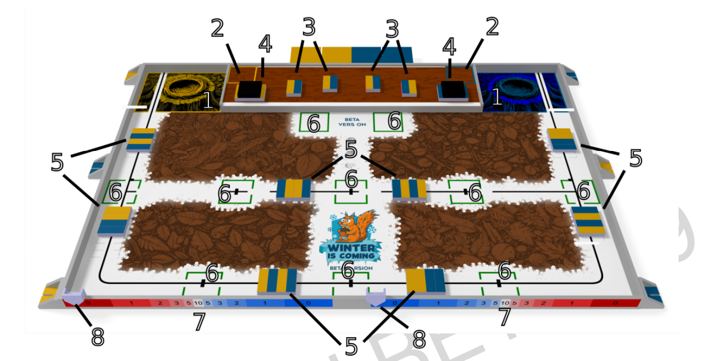

# 🐿️ Projet PAMI - Spip  (Coupe de France de Robotique)

##  Présentation de la Coupe
La **Coupe de France de Robotique** (Eurobot Open France) est une compétition annuelle organisée par **Planète Sciences**.  
Elle réunit des équipes étudiantes, associatives ou indépendantes, qui conçoivent des **robots autonomes** capables de relever des défis techniques en lien avec un thème annuel.
Depuis **plus de 10 ans**, l’association **ARES (Association de Robotique de l’ENSEA)** participe chaque année à cette compétition.  
En **2026**, la compétition se déroulera dans le cadre de la **33ᵉ édition des Rencontres de Robotique**.  
Le thème choisi est :  
> **« Winter is coming »**
Les robots auront 100 secondes pour réaliser un maximum d’actions sur une aire de jeu commune de 3 m x 2 m.
## Règlement
Le règlement complet est disponible sur le site officiel ([coupederobotique.fr](https://www.coupederobotique.fr/)), mais voici un résumé des grandes lignes :
### Aire du jeu 
Voici l’aire du jeu officielle de la Coupe de France de Robotique 2026 :

Légende :
1. Nid des écureuils  
2. Aires de départ PAMI dans le grenier  
3. Frigo  
4. Zone de chargement  
5. Zone de ramassage  
6. Garde-manger  
7. Thermomètre  
8. Curseur
### 🔹 Objectifs du thème
Les robots doivent aider les écureuils à stocker et protéger leurs noisettes en réalisant différentes actions :

1. **Gardons les noisettes au chaud !**  
   Ramasser les caisses de noisettes et les déposer dans un **garde-manger** ou dans le **nid**.  
   
2. **Trouver, c’est garder !**  
   Utiliser un petit actionneur mobile (PAMI) pour vider les **frigos** du grenier et les remplir avec des **caisses pourries**.  
   
3. **Pas trop chaud, ni trop froid.**  
   Déplacer le **curseur du thermomètre** pour régler la température au plus près du centre.  
   
4. **On est mieux dans son nid.**  
   Finir le match avec le **robot principal dans le nid**.  
   
5. **À table !**  
   Les petits écureuils (PAMIs) doivent rejoindre les **garde-mangers** et « manger » les noisettes.

Voici l'organisation principale du projet :

* 📁 **[Firmware](./Firmware/)** : Contient le code embarqué pour les microcontrôleurs, incluant l'asservissement.
* 📁 **[Hardware](./Hardware/)** : Regroupe les conceptions électroniques (PCB) et les modélisations mécaniques (3D).
* 📁 **[Datasheets](./Datasheets/)** : Contient l’ensemble des datasheets des différents composants utilisés.
* 📁 **[Strategie](./Strategie/)** : Documents et algorithmes définissant le comportement du robot pendant les matchs.
* 📁 **[Tableau de bord](./Tableau%20de%20bord/)** : Outils de monitoring et suivi des indicateurs de l'équipe.
  

