# 🐿️ Projet PAMI - Spip  (Coupe de France de Robotique)


##  Présentation de la Coupe
La **Coupe de France de Robotique** (Eurobot Open France) est une compétition annuelle organisée par **Planète Sciences**.  
Elle réunit des équipes étudiantes, associatives ou indépendantes, qui conçoivent des **robots autonomes** capables de relever des défis techniques en lien avec un thème annuel.
Depuis **plus de 10 ans**, l’association **ARES (Association de Robotique de l’ENSEA)** participe chaque année à cette compétition.  
En **2026**, la compétition se déroulera dans le cadre de la **33ᵉ édition des Rencontres de Robotique**.  
Le thème choisi est :  
> **« Winter is coming »**
Les robots auront 100 secondes pour réaliser un maximum d’actions sur une aire de jeu commune de 3 m x 2 m.
## Règlement
Le règlement complet est disponible sur le site officiel ([coupederobotique.fr](https://www.coupederobotique.fr/)), mais voici un résumé des grandes lignes :
### Aire du jeu 
Voici l’aire du jeu officielle de la Coupe de France de Robotique 2026 :
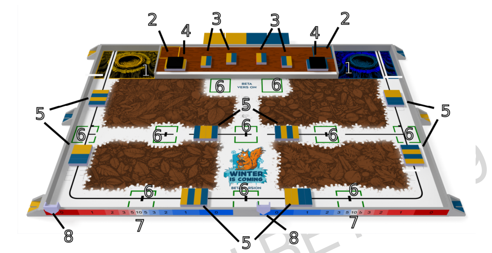
Légende :
1. Nid des écureuils  
2. Aires de départ PAMI dans le grenier  
3. Frigo  
4. Zone de chargement  
5. Zone de ramassage  
6. Garde-manger  
7. Thermomètre  
8. Curseur
### 🔹 Objectifs du thème
Les robots doivent aider les écureuils à stocker et protéger leurs noisettes en réalisant différentes actions :

1. **Gardons les noisettes au chaud !**  
   Ramasser les caisses de noisettes et les déposer dans un **garde-manger** ou dans le **nid**.  
   
2. **Trouver, c’est garder !**  
   Utiliser un petit actionneur mobile (PAMI) pour vider les **frigos** du grenier et les remplir avec des **caisses pourries**.  
   
3. **Pas trop chaud, ni trop froid.**  
   Déplacer le **curseur du thermomètre** pour régler la température au plus près du centre.  
   
4. **On est mieux dans son nid.**  
   Finir le match avec le **robot principal dans le nid**.  
   
5. **À table !**  
   Les petits écureuils (PAMIs) doivent rejoindre les **garde-mangers** et « manger » les noisettes.

Voici l'organisation principale du projet :

* 📁 **[Firmware](./Firmware/)** : Contient le code embarqué pour les microcontrôleurs, incluant l'asservissement.
* 📁 **[Hardware](./Hardware/)** : Regroupe les conceptions électroniques (PCB) et les modélisations mécaniques (3D).
* 📁 **[Datasheets](./Datasheets/)** : Contient l’ensemble des datasheets des différents composants utilisés.
* 📁 **[Strategie](./Strategie/)** : Documents et algorithmes définissant le comportement du robot pendant les matchs.
* 📁 **[Tableau de bord](./Tableau%20de%20bord/)** : Outils de monitoring et suivi des indicateurs de l'équipe.
  
  
# Rapport de projet - SPIP

## 1. Introduction

Le projet SPIP consiste à concevoir un robot PAMI pour la Coupe de France de Robotique. Le robot doit être autonome, compact, capable de se déplacer de manière contrôlée, d'interagir avec le terrain, d'éviter les obstacles et de réaliser des actions simples pendant le match.

Notre travail a donc porté sur trois grands axes :

- le choix et l'intégration des composants ;
- la conception électronique du robot avec KiCad ;
- le développement du firmware embarqué sur STM32.

Le robot est organisé autour d'une carte électronique principale. Cette carte relie le microcontrôleur, les moteurs, les encodeurs, les capteurs, les boutons, les LEDs, le connecteur de programmation et l'actionneur XL-320.

## 2. Objectif global du robot

Le robot doit pouvoir se déplacer de façon autonome sur l'aire de jeu de la Coupe de France de Robotique. Pour cela, nous avons besoin :

- d'un cerveau capable de piloter tous les périphériques ;
- de deux moteurs ;
- d'encodeurs pour connaître le déplacement réel ;
- d'un capteur ultrason pour détecter les obstacles ;
- d'un suiveur de ligne infrarouge pour corriger la trajectoire ;
- d'un servomoteur XL-320 pour actionner une partie mobile ;
- d'une carte électronique pour relier tous les éléments.

L'architecture générale est la suivante :

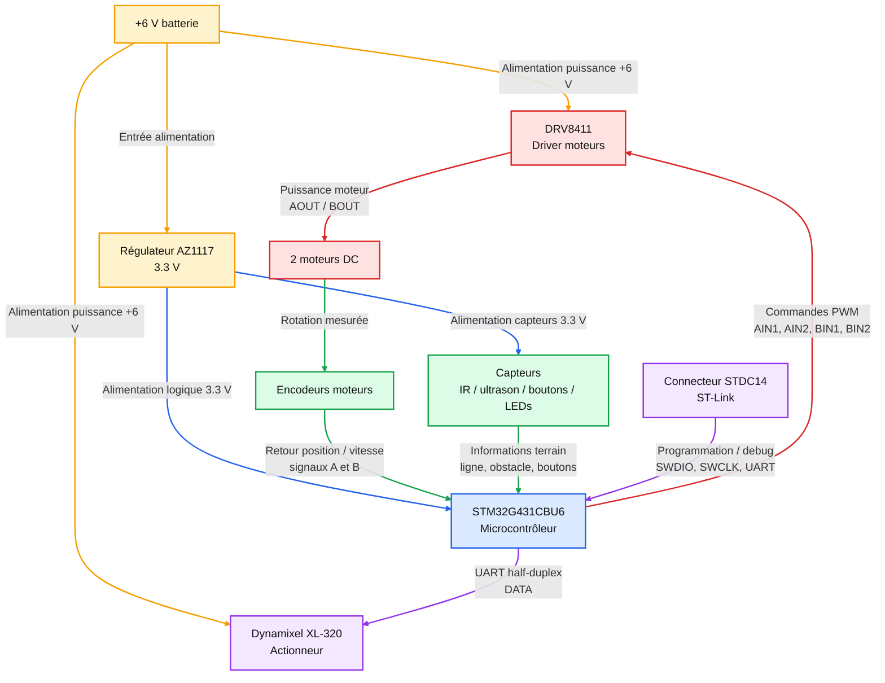
```mermaid
flowchart TD
    Batterie["+6 V batterie"] -->|Alimentation puissance +6 V| Driver["DRV8411<br/>Driver moteurs"]
    Batterie -->|Alimentation puissance +6 V| XL320["Dynamixel XL-320<br/>Actionneur"]
    Batterie -->|Entrée alimentation| Regulateur["Régulateur AZ1117<br/>3.3 V"]

    Regulateur -->|Alimentation logique 3.3 V| STM32["STM32G431CBU6<br/>Microcontrôleur"]
    Regulateur -->|Alimentation capteurs 3.3 V| Capteurs["Capteurs<br/>IR / ultrason / boutons / LEDs"]

    STM32 -->|Commandes PWM<br/>AIN1, AIN2, BIN1, BIN2| Driver
    Driver -->|Puissance moteur<br/>AOUT / BOUT| Moteurs["2 moteurs DC"]

    Moteurs -->|Rotation mesurée| Encodeurs["Encodeurs moteurs"]
    Encodeurs -->|Retour position / vitesse<br/>signaux A et B| STM32

    Capteurs -->|Informations terrain<br/>ligne, obstacle, boutons| STM32
    STM32 -->|UART half-duplex<br/>DATA| XL320

    STLINK["Connecteur STDC14<br/>ST-Link"] -->|Programmation / debug<br/>SWDIO, SWCLK, UART| STM32

    classDef power fill:#fff3cd,stroke:#f59f00,stroke-width:2px,color:#111;
    classDef logic fill:#dbeafe,stroke:#2563eb,stroke-width:2px,color:#111;
    classDef command fill:#fee2e2,stroke:#dc2626,stroke-width:2px,color:#111;
    classDef sensor fill:#dcfce7,stroke:#16a34a,stroke-width:2px,color:#111;
    classDef debug fill:#f3e8ff,stroke:#9333ea,stroke-width:2px,color:#111;

    class Batterie,Regulateur power;
    class STM32 logic;
    class Driver,Moteurs command;
    class Encodeurs,Capteurs sensor;
    class XL320,STLINK debug;

    linkStyle 0 stroke:#f59f00,stroke-width:2px;
    linkStyle 1 stroke:#f59f00,stroke-width:2px;
    linkStyle 2 stroke:#f59f00,stroke-width:2px;
    linkStyle 3 stroke:#2563eb,stroke-width:2px;
    linkStyle 4 stroke:#2563eb,stroke-width:2px;
    linkStyle 5 stroke:#dc2626,stroke-width:2px;
    linkStyle 6 stroke:#dc2626,stroke-width:2px;
    linkStyle 7 stroke:#16a34a,stroke-width:2px;
    linkStyle 8 stroke:#16a34a,stroke-width:2px;
    linkStyle 9 stroke:#16a34a,stroke-width:2px;
    linkStyle 10 stroke:#9333ea,stroke-width:2px;
    linkStyle 11 stroke:#9333ea,stroke-width:2px;
```

**Légende des liens :**

<div style="display: flex; flex-direction: column; gap: 6px; margin-top: 8px;">

<div style="background-color: #fff3cd; border-left: 6px solid #f59f00; padding: 8px;">
<strong>Orange</strong> : alimentation puissance <code>+6 V</code>.
</div>

<div style="background-color: #dbeafe; border-left: 6px solid #2563eb; padding: 8px;">
<strong>Bleu</strong> : alimentation logique <code>3.3 V</code>.
</div>

<div style="background-color: #fee2e2; border-left: 6px solid #dc2626; padding: 8px;">
<strong>Rouge</strong> : commande moteur et puissance moteur.
</div>

<div style="background-color: #dcfce7; border-left: 6px solid #16a34a; padding: 8px;">
<strong>Vert</strong> : retours capteurs et encodeurs vers le STM32.
</div>

<div style="background-color: #f3e8ff; border-left: 6px solid #9333ea; padding: 8px;">
<strong>Violet</strong> : programmation, debug et communication série.
</div>

</div>

## 3. Choix des composants

> **Note de conception :** Pour consulter l'inventaire complet du matériel et le détail des calculs de dimensionnement (calculs de puissance, choix des tailles de boîtiers CMS, etc.), reportez-vous au [Document de détails](./Hardware/details.md).

### 3.1 Microcontrôleur STM32G431CBU6

Nous avons choisi le **STM32G431CBU6** comme microcontrôleur principal du robot.

Datasheet : [Datasheet officielle STMicroelectronics](https://www.st.com/resource/en/datasheet/stm32g431cb.pdf)

Ce composant a été choisi car il correspond bien aux besoins du robot :

- il fonctionne en logique **3.3 V**, ce qui est adapté à notre circuit ;
- il dispose de nombreux GPIO pour connecter les capteurs, boutons, LEDs et signaux moteurs ;
- il intègre plusieurs timers, indispensables pour générer des signaux PWM et lire les encodeurs ;
- il possède des interfaces UART, utiles pour communiquer avec le XL-320 et avec le ST-Link ;
- son cœur ARM Cortex-M4 à 170 MHz offre assez de puissance pour faire tourner l'asservissement, la stratégie et les capteurs en parallèle.

Dans notre projet, le STM32 sert donc de centre de décision. Il lit les capteurs, calcule les consignes de mouvement, pilote les moteurs et exécute la stratégie de match.

### 3.2 Driver moteur DRV8411APWPR

Pour piloter les deux moteurs DC, nous avons utilisé un **DRV8411APWPR**.

Datasheet : [Datasheet Texas Instruments DRV8411](https://www.ti.com/lit/ds/symlink/drv8411.pdf)

Le STM32 ne peut pas alimenter directement les moteurs, car ses broches ne fournissent pas assez de courant. Le DRV8411 joue donc le rôle d'interface de puissance entre le microcontrôleur et les moteurs.

Nous l'avons choisi car :

- il permet de piloter deux moteurs DC avec un seul circuit ;
- il fonctionne avec des signaux logiques compatibles avec le STM32 ;
- il accepte une alimentation moteur séparée, ici le rail **+6 V** ;
- il possède une sortie de défaut, notée `FAULT`, permettant au microcontrôleur de détecter un problème ;
- il peut être commandé par des signaux PWM pour régler la vitesse.

Dans le schéma KiCad, les signaux importants sont :

- `AIN1` et `AIN2` pour le moteur A ;
- `BIN1` et `BIN2` pour le moteur B ;
- `AOUT1`, `AOUT2`, `BOUT1`, `BOUT2` vers les connecteurs moteurs ;
- `FAULT` vers le STM32 ;
- `AIPROPI` et `BIPROPI` avec des résistances pour la partie mesure/protection du driver.

### 3.3 Moteurs DC avec encodeurs

Le robot utilise deux moteurs DC avec encodeurs intégrés.

Dans le schéma KiCad, les connecteurs moteurs sont des connecteurs JST 6 broches :

- `J6` pour un moteur ;
- `J7` pour l'autre moteur.

Chaque connecteur transporte :

- les deux sorties moteur venant du driver ;
- l'alimentation de l'encodeur ;
- la masse ;
- les deux signaux encodeur A et B.

Nous avons choisi des moteurs avec encodeurs car un simple moteur DC ne permet pas de connaître la distance réelle parcourue. Avec les encodeurs, le STM32 peut compter les impulsions et en déduire :

- la distance parcourue ;
- la vitesse réelle ;
- le sens de rotation ;
- l'erreur entre la consigne et le mouvement réel.

Cela permet de faire un asservissement et d'obtenir des déplacements plus précis.

### 3.4 Servomoteur Dynamixel XL-320

Le robot utilise un **Dynamixel XL-320** comme actionneur pour une partie mobile, notamment la queue.

Datasheet : [Documentation ROBOTIS officielle](https://emanual.robotis.com/docs/en/dxl/x/xl320/)

Nous avons choisi le XL-320 car c'est un servomoteur intelligent. Contrairement à un servo simple, il intègre déjà :

- un moteur ;
- un contrôleur ;
- une électronique de puissance ;
- un protocole de communication ;
- un retour d'état.

Il se commande avec une liaison série half-duplex. Dans KiCad, il est relié par le connecteur `J3`, avec :

- `+6V` pour l'alimentation ;
- `GND` ;
- `DATA` pour la communication.

Dans le `.ioc`, la broche `PC4` est configurée en `USART1` half-duplex pour communiquer avec le XL-320.

### 3.5 Capteur ultrason HC-SR04

Le capteur ultrason est utilisé pour détecter les obstacles devant le robot.

Datasheet : [Datasheet HC-SR04 via DigiKey](https://www.digikey.com/en/htmldatasheets/production/3822706/0/0/1/hc-sr04.html)

Nous l'avons ajouté pour que le robot puisse s'arrêter lorsqu'un objet ou un autre robot se trouve trop près. Le principe est simple :

- le STM32 envoie une impulsion sur `TRIG` ;
- le capteur émet une onde ultrasonore ;
- le signal `ECHO` reste actif pendant une durée proportionnelle à la distance ;
- le STM32 mesure cette durée et calcule la distance.

Dans KiCad, le capteur est relié au connecteur `J4` :

- `+3.3V` ;
- `TRIGG` ;
- `ECHO` ;
- `GND`.

Dans le code, si la distance mesurée est inférieure à 10 cm, le robot met les deux vitesses moteur à zéro. Cela permet d'éviter une collision.

### 3.6 Suiveur de ligne infrarouge

Le suiveur de ligne infrarouge est utilisé pour détecter la position du robot par rapport à une ligne au sol.

Dans KiCad, le connecteur `J5` relie le module infrarouge au STM32 :

- `+3.3V` ;
- `X1` ;
- `X2` ;
- `X3` ;
- `X4` ;
- `GND`.

Nous avons choisi un suiveur de ligne à plusieurs sorties car il donne plus d'information qu'un seul capteur. Avec quatre signaux, le robot peut savoir si la ligne est :

- centrée ;
- décalée à gauche, légèrement ou fortement ;
- décalée à droite, légèrement ou fortement ;
- perdue ou détectée partiellement.

Dans le firmware, les valeurs des quatre capteurs sont combinées dans une variable `position`. Cette position peut ensuite être utilisée pour corriger la trajectoire du robot.

### 3.7 Régulateur AZ1117-3.3

Le régulateur **AZ1117-3.3** permet de créer le rail d'alimentation 3.3 V à partir de l'alimentation principale.

Datasheet : [Datasheet officielle AZ1117](https://www.diodes.com/assets/Datasheets/AZ1117.pdf)

Nous l'avons ajouté car le STM32 et plusieurs signaux logiques doivent être alimentés en 3.3 V, alors que la partie puissance du robot fonctionne avec une tension plus élevée, notamment le rail +6 V.

Dans KiCad, le régulateur est accompagné de condensateurs de découplage et de stabilisation. Ces condensateurs servent à limiter les variations de tension et à rendre l'alimentation plus stable.

### 3.8 Condensateurs de découplage

Le schéma KiCad contient plusieurs condensateurs :

- `100nF` près des circuits intégrés ;
- `1uF`, `10uF` et `22uF` pour stabiliser les rails d'alimentation ;
- des condensateurs autour du driver moteur et du régulateur.

Datasheets :

- [Wurth 100 nF 885012205085](https://www.we-online.com/components/products/datasheet/885012205085.pdf)
- [Wurth 10 nF 885012205067](https://www.we-online.com/components/products/datasheet/885012205067.pdf)
- [Wurth 1 uF 885012206076](https://www.we-online.com/components/products/datasheet/885012206076.pdf)
- [Wurth 22 uF 885012107019](https://www.we-online.com/components/products/datasheet/885012107019.pdf)

Ces condensateurs sont nécessaires car les moteurs et les circuits numériques peuvent créer des variations rapides de courant. Sans découplage, ces variations pourraient provoquer des resets du microcontrôleur ou des comportements instables.

### 3.9 Résistances

Le PCB utilise plusieurs résistances :

- résistances de tirage pour les boutons ;
- résistances en série avec les LEDs ;
- résistances liées au driver moteur ;
- résistance de `BOOT0` ;
- résistances de valeurs particulières comme `82k5`.

Datasheets :

- [Yageo RC0805 general purpose](https://www.yageo.com/upload/media/product/productsearch/datasheet/rchip/PYu-RC_Group_51_RoHS_L_12.pdf)
- [RS Pro 1 kOhm](https://docs.rs-online.com/21eb/0900766b8157cb45.pdf)

Les résistances de LEDs sont dimensionnées pour limiter le courant. Les annotations du schéma indiquent les tensions directes des LEDs, par exemple `1.7V @ 1mA`, `2.3V @ 1mA` ou `2.6V @ 1mA`. Le but est d'avoir des voyants visibles sans consommer trop de courant ni endommager les LEDs.

### 3.10 LEDs utilisateur

Le PCB contient plusieurs LEDs, reliées à des signaux comme :

- `LEDR` ;
- `LEDG` ;
- `LEDB`.

Datasheets :

- [LED rouge Wurth 150060RS55040](https://www.we-online.com/components/products/datasheet/150060RS55040.pdf)
- [LED verte Wurth 150060GS55040](https://www.we-online.com/components/products/datasheet/150060GS55040.pdf)
- [LED bleue Wurth 150060BS55040](https://www.we-online.com/components/products/datasheet/150060BS55040.pdf)

Nous les avons ajoutées pour faciliter les tests. Elles peuvent indiquer un état du robot, un mode de fonctionnement, une erreur ou une étape de stratégie.

### 3.11 Boutons utilisateur

Le PCB contient plusieurs boutons, associés aux signaux :

- `Button1` ;
- `Button2` ;
- `Button3`.

Ils permettent de déclencher manuellement des actions, de changer d'état ou de lancer une séquence de test. Dans le `.ioc`, ces boutons sont configurés en interruptions externes, ce qui permet au STM32 de réagir immédiatement à un appui.

### 3.12 Connecteur de programmation STDC14

Le connecteur `J2` est un connecteur **STDC14**. Il sert à programmer et déboguer le STM32 avec un ST-Link.

Documentation :

- [Documentation STDC14 / STLINK-V3](https://www.st.com/content/ccc/resource/technical/document/user_manual/group1/99/49/91/b6/b2/3a/46/e5/DM00526767/files/DM00526767.pdf/jcr:content/translations/en.DM00526767.pdf)

Il relie notamment :

- `SWDIO` ;
- `SWCLK` ;
- `NRST` ;
- `STLINK_TX` ;
- `STLINK_RX` ;
- `3.3V` ;
- `GND`.

Nous l'avons mis pour pouvoir flasher le programme, déboguer le code et utiliser une liaison UART avec l'ordinateur.

## 4. Explication du projet KiCad

Le projet KiCad se trouve dans :

- [Schéma KiCad](./Hardware/Kicad_SPIP/Kicad_SPIP.kicad_sch)
- [PCB KiCad](./Hardware/Kicad_SPIP/Kicad_SPIP.kicad_pcb)

Le schéma est organisé en blocs fonctionnels :

- alimentation générale ;
- STM32G431CBU6 ;
- driver + moteurs ;
- servo XL-320 ;
- ultrason ;
- infrarouge ;
- boutons ;
- LEDs ;
- programmateur ;
- trous de fixation.

Cette organisation permet de comprendre rapidement le rôle de chaque partie.

### 4.1 Bloc alimentation

Le bloc alimentation sépare deux niveaux de tension :

- `+6V` pour les éléments de puissance, comme les moteurs et le XL-320 ;
- `+3.3V` pour le STM32 et les signaux logiques.

Le régulateur transforme la tension principale en 3.3 V. Des condensateurs sont placés autour des rails d'alimentation pour éviter les chutes de tension lors des appels de courant.

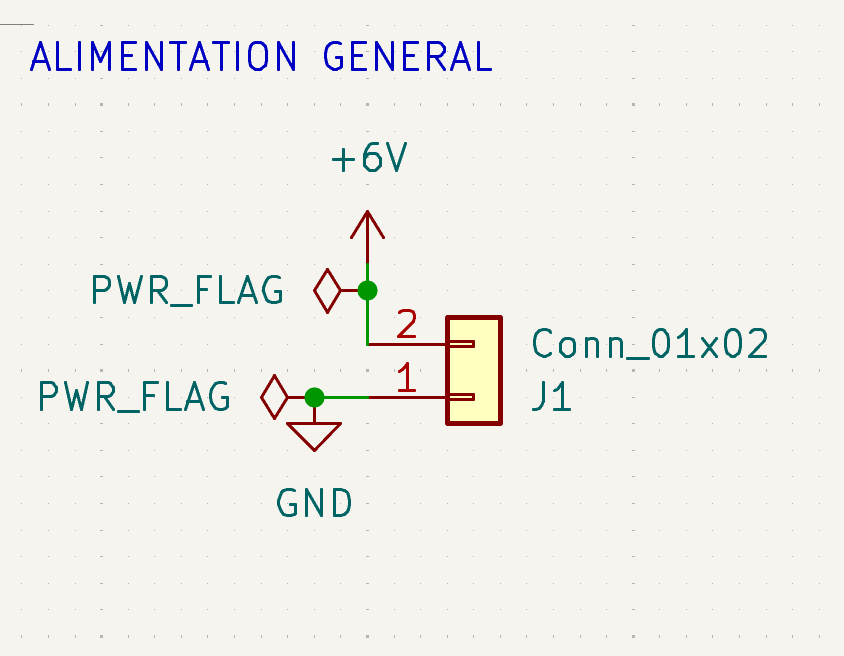
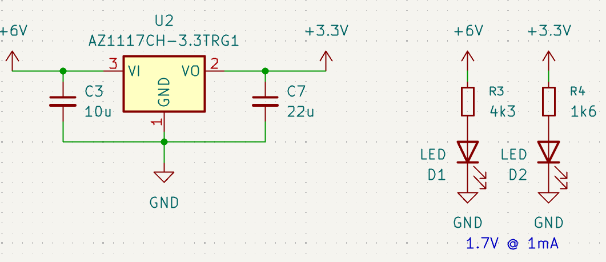

### 4.2 Bloc STM32

Le STM32 est au centre du schéma. Les pins sont nommées selon leur rôle logiciel :

- `PA0-US_TRIG` ;
- `PA1-US_ECHO_INT` ;
- `PA4-X1_INT` à `PA7-X4_INT` ;
- `PC4-UART_XL320` ;
- `PB10-MotorFault` ;
- `PB4/PB5` pour l'encodeur du moteur A ;
- `PB6/PB7` pour l'encodeur du moteur B ;
- `PA15/PB3/PA9/PA10` pour les PWM moteur ;
- `PA13/PA14` pour le debug SWD.

Le fait de nommer les signaux directement dans KiCad rend le schéma plus lisible et facilite la correspondance avec le fichier `.ioc`.

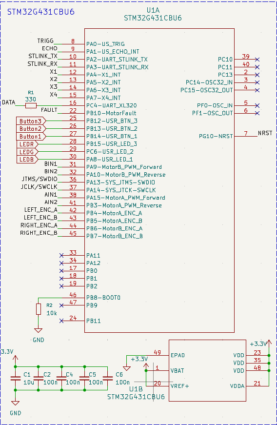

### 4.3 Bloc driver moteur

Le bloc moteur contient le DRV8411 et les connecteurs moteurs. Le STM32 envoie des signaux PWM au driver, et le driver fournit le courant aux moteurs.

Nous avons séparé la partie commande et la partie puissance :

- le STM32 commande avec des signaux logiques ;
- le driver gère le courant moteur ;
- les encodeurs renvoient l'information de mouvement au STM32.

Cette séparation est indispensable, car elle protège le microcontrôleur et permet un pilotage plus précis.

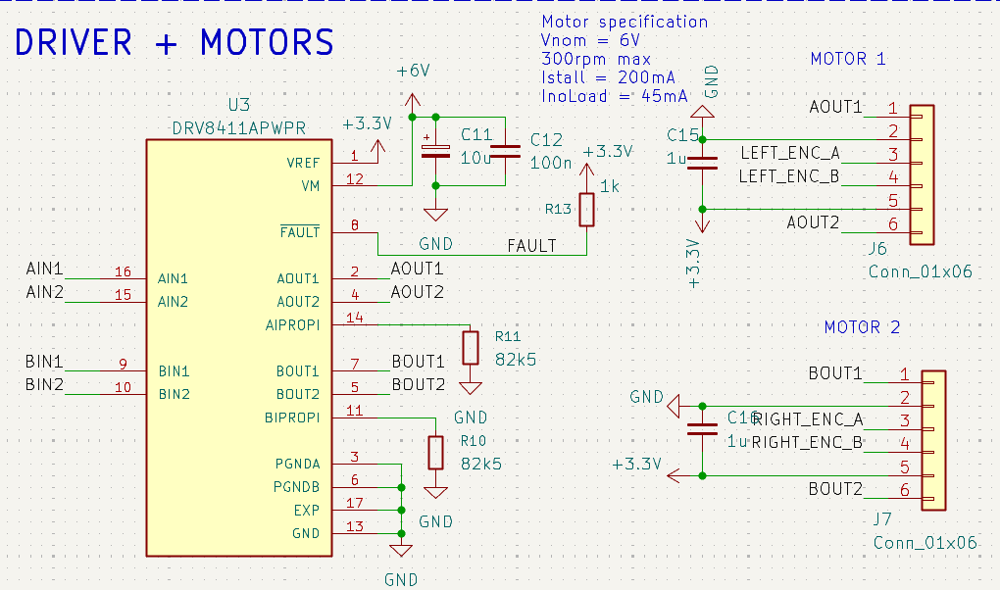

### 4.4 Bloc programmateur

Le connecteur STDC14 sert à relier le ST-Link pour flasher le programme et déboguer le code. 

Il permet d'accéder directement aux signaux de programmation `SWDIO` et `SWCLK`, ainsi qu'aux broches UART du STM32 pour envoyer des données vers l'ordinateur pendant les tests.

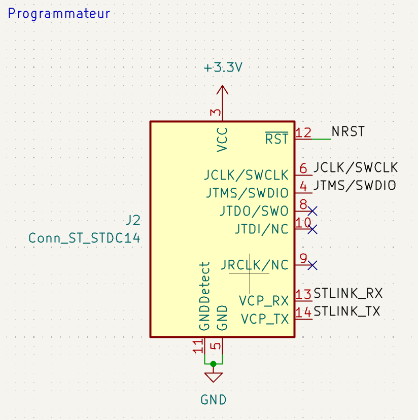

### 4.5 Bloc servomoteur intelligent

Ce bloc contient le connecteur pour le servomoteur Dynamixel XL-320. 

Le connecteur est relié au rail `+6V` pour la puissance et utilise la broche `PC4` configurée en UART half-duplex pour l'échange de données. Cette configuration permet de commander la position de l'actionneur avec un seul fil de signal.

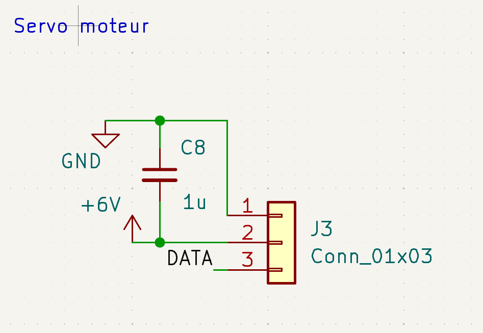

### 4.6 Bloc capteurs

Le bloc capteurs regroupe l'ultrason et les capteurs infrarouges.

L'ultrason est utilisé pour l'évitement d'obstacles. Les capteurs infrarouges servent à suivre une ligne ou à détecter un décalage latéral.

Dans le PCB, ces capteurs sont connectés par des JST. Cela permet de démonter ou remplacer facilement un capteur sans ressouder la carte.

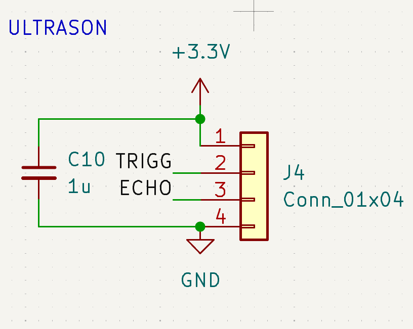
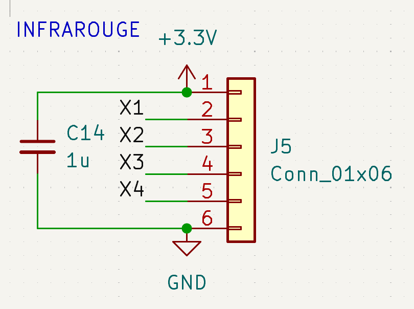

### 4.7 Bloc interface utilisateur

Les boutons et les LEDs permettent de tester le robot sans avoir besoin de modifier le code à chaque fois. Les boutons peuvent lancer des actions, et les LEDs peuvent afficher l'état du robot.

Ce bloc est utile pendant les phases de debug, car il donne un retour visuel immédiat.

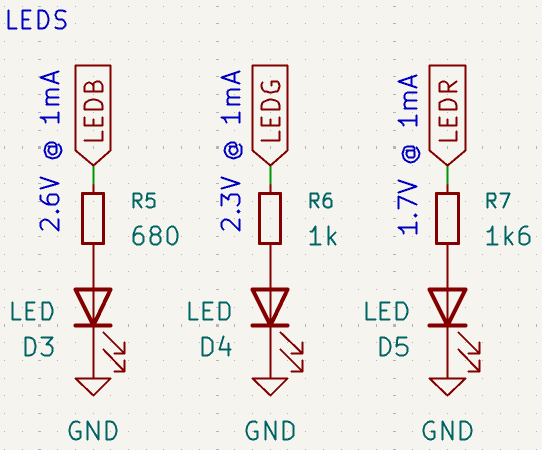
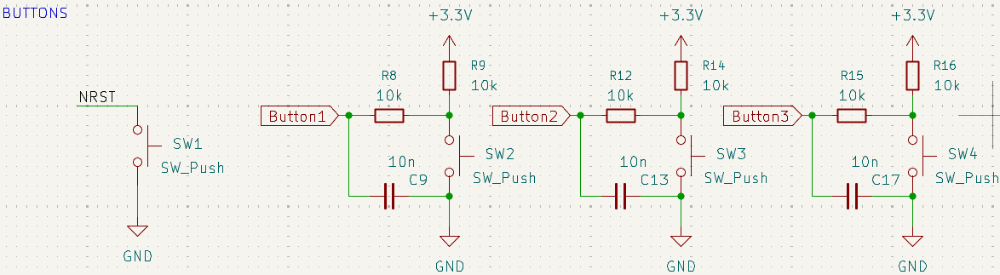

### 4.8 Routage du PCB

Dans le PCB, les composants principaux sont placés de manière à limiter les longueurs de pistes :

- le STM32 est proche des signaux logiques ;
- le driver moteur est proche des connecteurs moteurs ;
- les connecteurs capteurs sont en bord de carte pour faciliter le câblage ;
- les trous de fixation permettent une intégration propre dans le châssis.

Les rails `GND`, `+3.3V` et `+6V` sont clairement séparés dans les nets KiCad. Cela permet de distinguer la puissance moteur de la logique microcontrôleur.
## 5. Configuration STM32CubeIDE et fichier `.ioc`

Le fichier de configuration est :

- [Firware_SPIP.ioc](./Firmware/Firware_SPIP/Firware_SPIP.ioc)

Ce fichier relie la conception électronique au code embarqué. Il indique quel pin du microcontrôleur correspond à chaque fonction.

### 5.1 Horloge

Le STM32 est configuré avec une fréquence système de **170 MHz**. Cette fréquence permet d'avoir assez de précision pour :

- les PWM moteurs ;
- la mesure ultrason ;
- les timers d'interruption ;
- l'asservissement.

### 5.2 TIM2 pour les PWM moteurs

Le timer `TIM2` est utilisé avec quatre canaux PWM :

- `TIM2_CH1` : `MotorA_PWM_Forward` ;
- `TIM2_CH2` : `MotorA_PWM_Reverse` ;
- `TIM2_CH3` : `MotorB_PWM_Forward` ;
- `TIM2_CH4` : `MotorB_PWM_Reverse`.

Ce choix permet de gérer le sens et la vitesse des deux moteurs. Chaque moteur a deux commandes, une pour le sens avant et une pour le sens arrière.

### 5.3 TIM3 et TIM4 pour les encodeurs

Les timers `TIM3` et `TIM4` sont configurés en mode encodeur :

- `TIM3` lit l'encodeur du moteur A ;
- `TIM4` lit l'encodeur du moteur B.

Le mode encodeur permet au microcontrôleur de compter automatiquement les impulsions A/B des encodeurs, ce qui donne une mesure fiable du mouvement.

### 5.4 TIM1 pour l'ultrason

Le timer `TIM1` est utilisé pour mesurer la durée du signal `ECHO` du capteur ultrason. Son prescaler permet d'obtenir une base de temps adaptée à la mesure en microsecondes.

Cette mesure est ensuite convertie en distance.

### 5.5 TIM6 comme ordonnanceur périodique

Le timer `TIM6` déclenche régulièrement une interruption. Dans cette interruption, le programme :

- déclenche l'ultrason ;
- met à jour le suiveur de ligne ;
- met à jour les encodeurs ;
- met à jour l'asservissement ;
- met à jour le mouvement ;
- remet périodiquement à zéro l'erreur cumulée du correcteur.

Cela permet de faire fonctionner plusieurs sous-systèmes en parallèle.

### 5.6 USART1 pour le XL-320

`USART1` est configuré en half-duplex sur `PC4`. Cela correspond au fonctionnement du XL-320, qui utilise une seule ligne de données pour envoyer et recevoir.

### 5.7 USART2 pour le ST-Link

`USART2` utilise `PA2` et `PA3`. Cette liaison peut servir au debug avec le ST-Link, par exemple pour afficher des informations sur un terminal série.

### 5.8 Interruptions externes

Plusieurs pins sont configurées en interruptions :

- `US_ECHO_INT` pour détecter les fronts du signal ultrason ;
- `MotorFault` pour détecter un problème driver ;
- les boutons utilisateur.

Les interruptions permettent de réagir rapidement à des événements sans attendre la boucle principale.

## 6. Explication du firmware

Le code embarqué se trouve dans :

- [Core/Src](./Firmware/Firware_SPIP/Core/Src)
- [Core/Inc](./Firmware/Firware_SPIP/Core/Inc)

Le firmware est séparé en modules. Chaque module gère une partie précise du robot.

### 6.1 `motor.c` et `motor.h`

Le module moteur gère le PWM appliqué aux moteurs. Il transforme une consigne de vitesse finale en rapport cyclique PWM.

Nous avons séparé ce module car le pilotage bas niveau des moteurs doit être indépendant de la stratégie. La stratégie dit au robot quoi faire, tandis que `motor.c` applique physiquement la puissance aux moteurs.

### 6.2 `encoder.c` et `encoder.h`

Le module encodeur lit les compteurs des timers en mode encodeur. Il calcule les variations de ticks entre deux appels.

Ces ticks sont essentiels pour connaître le mouvement réel. Sans encodeur, le robot pourrait dériver à cause des différences entre les moteurs, du frottement ou de la batterie.

### 6.3 `control.c` et `control.h`

Le module d'asservissement compare la vitesse demandée avec la vitesse mesurée par les encodeurs.

Le code calcule une erreur :

```c
error = control->ref_speed - 1000 * encoder->delta_ticks;
```

Puis il applique une correction proportionnelle et intégrale :

```c
motor->speed_final = control->ref_speed
                   + (control->Kp * error)
                   + (control->Ki * control->error_cumul);
```

Nous avons utilisé ce principe car les deux moteurs ne tournent jamais exactement pareil. L'asservissement permet de corriger les écarts et d'obtenir un mouvement plus régulier.

### 6.4 `move.c` et `move.h`

Le module mouvement gère les ordres de haut niveau :

- avancer d'une certaine distance ;
- tourner d'un certain angle ;
- s'arrêter ;
- s'arrêter en cas d'obstacle ultrason.

La fonction `move_forward` convertit une distance en centimètres en ticks encodeur. Pour cela, on utilise le périmètre de la roue :

```c
float perimeter_cm = 2.0f * M_PI * move->radius;
float K = encoder->cnt_tr / perimeter_cm;
move->d_target_cnt = d_target_cm * K;
```

Cette conversion permet de donner des ordres simples en centimètres tout en utilisant les encodeurs en interne.

### 6.5 Correction par suiveur de ligne

Le suiveur de ligne est lu régulièrement dans l'interruption du timer grâce à `LF_Update(&h_lineFollower)`. Cette fonction met à jour la position détectée par les quatre capteurs infrarouges.

Cette position est ensuite transmise à `move_update` grâce à l'appel suivant dans `main.c` :

```c
move_update(&move, &control_left, &control_right,
            &encoder_left, &encoder_right,
            &us_sensor, &h_lineFollower);
```

### 6.6 `Line_Follower.c` et `Line_Follower.h`

Le module suiveur de ligne lit les quatre entrées infrarouges :

```c
lf->position = lf->sensor_values[0] * 1000
             + lf->sensor_values[1] * 100
             + lf->sensor_values[2] * 10
             + lf->sensor_values[3];
```

Cette méthode permet de transformer quatre lectures digitales en une seule valeur facile à comparer. Par exemple :

- `0110` devient `110`, considéré comme centre ;
- `1000` indique une détection à gauche ;
- `0001` indique une détection à droite.

### 6.7 `Ultrasound.c` et `Ultrasound.h`

Le module ultrason gère le capteur HC-SR04. Il déclenche le capteur, mesure le temps du signal echo et calcule la distance.

Dans `move_update`, la sécurité obstacle est prioritaire :

```c
if (us_sensor->distance_cm > 0.0f && us_sensor->distance_cm < 10.0f) {
    control_set_speed(control_left, 0);
    control_set_speed(control_right, 0);
    return;
}
```

Nous avons fait cela pour que le robot s'arrête immédiatement si un obstacle est trop proche.

### 6.8 `xl320.c` et `xl320.h`

Le module XL-320 initialise et commande le servomoteur Dynamixel.

Dans `main.c`, le XL-320 est initialisé avec l'UART puis configuré :

```c
XL320_Init(&huart1);
XL320_Config_LowPower(254);
XL320_SetSpeed(254, 300);
```

L'identifiant `254` correspond à un broadcast, ce qui permet d'envoyer une commande à tous les servos connectés.

### 6.9 `strategy.c` et `strategy.h`

Le module stratégie définit plusieurs séquences d'actions : `strat_one`, `strat_two`, `strat_three`, `strat_four` et `strat_five`.

Chaque stratégie correspond à un enchaînement différent de déplacements. La fonction reçoit aussi une couleur, par exemple `"yellow"` ou `"blue"`, afin d'adapter le sens du virage selon le côté du terrain.

La stratégie utilisée actuellement dans `main.c` est :

```c
strat_two(&status, "yellow");
```

Nous avons choisi une machine à états car elle permet de décrire clairement la séquence de match. Chaque état correspond à une action précise : avancer, attendre la fin du déplacement, tourner, attendre la fin du virage, puis passer à l'action suivante.

### 6.10 `main.c`

Le fichier `main.c` initialise tous les modules :

- capteur ultrason ;
- suiveur de ligne ;
- moteurs ;
- encodeurs ;
- mouvement ;
- asservissement ;
- stratégie ;
- XL-320.

Avant d'entrer dans la boucle principale, le programme utilise aussi une condition de départ liée au capteur ultrason :

```c
while (us_sensor.distance_cm < 10) {
    US_Update(&us_sensor);
    HAL_Delay(50);
}
```

Cette partie joue le rôle de tirette ou de condition de départ : le robot attend que la distance mesurée soit suffisante avant de lancer sa stratégie.

La boucle principale appelle actuellement la stratégie `strat_two` avec la couleur `"yellow"`, ainsi que le mouvement de la queue :

```c
while (1)
{
    strat_two(&status, "yellow");
    move_tail(&status_tail);
}
```

La couleur passée à la fonction permet d'adapter le sens du virage selon le côté de départ du robot. Les mises à jour rapides sont faites dans l'interruption de `TIM6`, ce qui permet de garder un comportement régulier.

## 7. Résumé

Nous avons séparé le code en modules pour rendre le projet plus lisible et plus facile à tester.

Chaque fichier a une responsabilité :

- `motor` pilote le PWM ;
- `encoder` lit les ticks ;
- `control` fait l'asservissement ;
- `move` gère les distances et les rotations ;
- `Line_Follower` lit les capteurs IR ;
- `Ultrasound` mesure les distances ;
- `xl320` commande le servomoteur ;
- `strategy` décide les actions ;
- `main` initialise et orchestre le système.

Ce découpage évite d'avoir tout le code dans un seul fichier et facilite les corrections.

## 8. Conclusion

Le projet SPIP combine une partie électronique, une partie mécanique et une partie logicielle. La carte KiCad a été conçue pour centraliser les connexions du robot autour du STM32G431CBU6. Le choix des composants répond aux besoins principaux : puissance moteur, mesure de position, détection d'obstacle, suivi de ligne, communication avec le servomoteur et debug.

Le firmware transforme cette architecture matérielle en comportement autonome. Les encodeurs permettent de mesurer le mouvement, l'asservissement corrige les erreurs de vitesse, le suiveur infrarouge prépare la correction de trajectoire, l'ultrason évite les obstacles, et la stratégie enchaîne les actions du robot.

L'ensemble du travail permet d'obtenir une base de robot autonome capable de se déplacer, se corriger, réagir à son environnement et exécuter une séquence de match.

## 9. Demonstration

Voici une vidéo de notre PAMI se dirigeaant vers un des gardes manger

