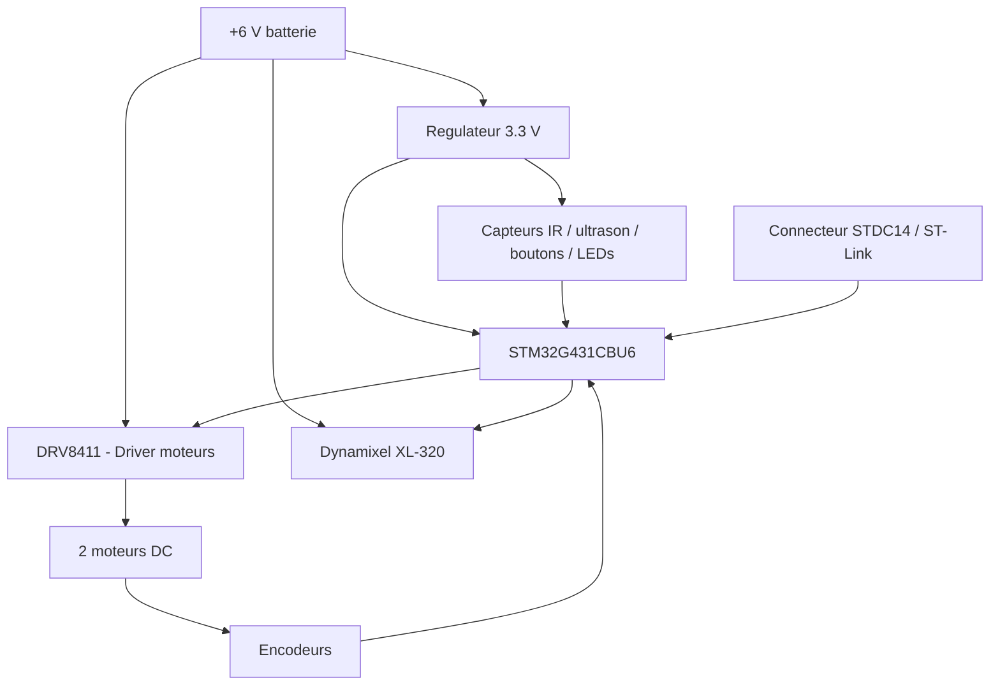

# 🐿️ Projet PAMI - Spip  (Coupe de France de Robotique)

##  Présentation de la Coupe
La **Coupe de France de Robotique** (Eurobot Open France) est une compétition annuelle organisée par **Planète Sciences**.  
Elle réunit des équipes étudiantes, associatives ou indépendantes, qui conçoivent des **robots autonomes** capables de relever des défis techniques en lien avec un thème annuel.
Depuis **plus de 10 ans**, l’association **ARES (Association de Robotique de l’ENSEA)** participe chaque année à cette compétition.  
En **2026**, la compétition se déroulera dans le cadre de la **33ᵉ édition des Rencontres de Robotique**.  
Le thème choisi est :  
> **« Winter is coming »**
Les robots auront 100 secondes pour réaliser un maximum d’actions sur une aire de jeu commune de 3 m x 2 m.
## Règlement
Le règlement complet est disponible sur le site officiel ([coupederobotique.fr](https://www.coupederobotique.fr/)), mais voici un résumé des grandes lignes :
### Aire du jeu 
Voici l’aire du jeu officielle de la Coupe de France de Robotique 2026 :

Légende :
1. Nid des écureuils  
2. Aires de départ PAMI dans le grenier  
3. Frigo  
4. Zone de chargement  
5. Zone de ramassage  
6. Garde-manger  
7. Thermomètre  
8. Curseur
### 🔹 Objectifs du thème
Les robots doivent aider les écureuils à stocker et protéger leurs noisettes en réalisant différentes actions :

1. **Gardons les noisettes au chaud !**  
   Ramasser les caisses de noisettes et les déposer dans un **garde-manger** ou dans le **nid**.  
   
2. **Trouver, c’est garder !**  
   Utiliser un petit actionneur mobile (PAMI) pour vider les **frigos** du grenier et les remplir avec des **caisses pourries**.  
   
3. **Pas trop chaud, ni trop froid.**  
   Déplacer le **curseur du thermomètre** pour régler la température au plus près du centre.  
   
4. **On est mieux dans son nid.**  
   Finir le match avec le **robot principal dans le nid**.  
   
5. **À table !**  
   Les petits écureuils (PAMIs) doivent rejoindre les **garde-mangers** et « manger » les noisettes.

Voici l'organisation principale du projet :

* 📁 **[Firmware](./Firmware/)** : Contient le code embarqué pour les microcontrôleurs, incluant l'asservissement.
* 📁 **[Hardware](./Hardware/)** : Regroupe les conceptions électroniques (PCB) et les modélisations mécaniques (3D).
* 📁 **[Datasheets](./Datasheets/)** : Contient l’ensemble des datasheets des différents composants utilisés.
* 📁 **[Strategie](./Strategie/)** : Documents et algorithmes définissant le comportement du robot pendant les matchs.
* 📁 **[Tableau de bord](./Tableau%20de%20bord/)** : Outils de monitoring et suivi des indicateurs de l'équipe.
  
  
# Rapport de projet - SPIP

## 1. Introduction

Le projet SPIP consiste a concevoir un robot PAMI pour la Coupe de France de Robotique. Le robot doit être autonome, compact, capable de se déplacer de manière controlée, d'intéragir avec le terrain, d'éviter les obstacles et de réaliser des actions simples pendant le match.

Notre travail a donc porte sur trois grands axes :

- le choix et l'integration des composants;
- la conception electronique du robot avec KiCad;
- le developpement du firmware embarque sur STM32.

Le robot est organisé autour d'une carte électronique principale. Cette carte relie le microcontroleur, les moteurs, les encodeurs, les capteurs, les boutons, les LEDs, le connecteur de programmation et l'actionneur XL-320.

## 2. Objectif global du robot

Le robot doit pouvoir se deplacer de facon autonome sur l'aire de jeu de la Coupe de France de Robotique. Pour cela, nous avons besoin :

- d'un cerveau capable de piloter tous les peripheriques ;
- de deux moteurs ;
- d'encodeurs pour connaitre le deplacement réel ;
- d'un capteur ultrason pour détecter les obstacles ;
- d'un suiveur de ligne infrarouge pour corriger la trajectoire ;
- d'un servomoteur XL-320 pour actionner une partie mobile ;
- d'une carte electronique pour relier tous les élements.

L'architecture generale est la suivante :

```mermaid
flowchart TD
    Batterie["+6 V batterie"] --> Regulateur["Regulateur 3.3 V"]
    Batterie --> Driver["DRV8411 - Driver moteurs"]
    Batterie --> XL320["Dynamixel XL-320"]
    Regulateur --> STM32["STM32G431CBU6"]
    Regulateur --> Capteurs["Capteurs IR / ultrason / boutons / LEDs"]
    STM32 --> Driver
    Driver --> Moteurs["2 moteurs DC"]
    Moteurs --> Encodeurs["Encodeurs"]
    Encodeurs --> STM32
    Capteurs --> STM32
    STM32 --> XL320
    STLINK["Connecteur STDC14 / ST-Link"] --> STM32
```
## 3. Choix des composants

### 3.1 Microcontroleur STM32G431CBU6

Nous avons choisi le **STM32G431CBU6** comme microcontroleur principal du robot.

Datasheets :

- [Datasheet locale STM32G431CBU6](./Datasheets/STM32G431CBU6_Datasheet.pdf)
- [Datasheet officielle STMicroelectronics](https://www.st.com/resource/en/datasheet/stm32g431cb.pdf)

Ce composant a ete choisi car il correspond bien aux besoins du robot :

- il fonctionne en logique **3.3 V**, ce qui est adapté à notre circuit ;
- il dispose de nombreux GPIO pour connecter les capteurs, boutons, LEDs et signaux moteurs ;
- il intègre plusieurs timers, indispensables pour générer des signaux PWM et lire les encodeurs ;
- il possède des interfaces UART, utiles pour communiquer avec le XL-320 et avec le ST-Link ;
- son coeur ARM Cortex-M4 a 170 MHz offre assez de puissance pour faire tourner l'asservissement, la strategie et les capteurs en parallele.

Dans notre projet, le STM32 sert donc de centre de decision. Il lit les capteurs, calcule les consignes de mouvement, pilote les moteurs et exécute la stratégie de match.

### 3.2 Driver moteur DRV8411APWPR

Pour piloter les deux moteurs DC, nous avons utilise un **DRV8411APWPR**.

Datasheets :

- [Datasheet locale DRV8411](./Datasheets/Driver_DATASHEET.pdf)
- [Datasheet Texas Instruments DRV8411](https://www.ti.com/lit/ds/symlink/drv8411.pdf)

Le STM32 ne peut pas alimenter directement les moteurs, car ses broches ne fournissent pas assez de courant. Le DRV8411 joue donc le role d'interface de puissance entre le microcontroleur et les moteurs.

Nous l'avons choisi car :

- il permet de piloter deux moteurs DC avec un seul circuit ;
- il fonctionne avec des signaux logiques compatibles avec le STM32 ;
- il accepte une alimentation moteur separée, ici le rail **+6 V** ;
- il possède une sortie de defaut, notee `FAULT`, permettant au microcontroleur de détecter un probleme ;
- il peut être commandé par des signaux PWM pour régler la vitesse.

Dans le schema KiCad, les signaux importants sont :

- `AIN1` et `AIN2` pour le moteur A ;
- `BIN1` et `BIN2` pour le moteur B ;
- `AOUT1`, `AOUT2`, `BOUT1`, `BOUT2` vers les connecteurs moteurs ;
- `FAULT` vers le STM32 ;
- `AIPROPI` et `BIPROPI` avec des resistances pour la partie mesure/protection du driver.

### 3.3 Moteurs DC avec encodeurs

Le robot utilise deux moteurs DC avec encodeurs intégrés.

Dans le schema KiCad, les connecteurs moteurs sont des connecteurs JST 6 broches :

- `J6` pour un moteur ;
- `J7` pour l'autre moteur.

Chaque connecteur transporte :

- les deux sorties moteur venant du driver ;
- l'alimentation de l'encodeur ;
- la masse ;
- les deux signaux encodeur A et B.

Nous avons choisi des moteurs avec encodeurs car un simple moteur DC ne permet pas de connaitre la distance réelle parcourue. Avec les encodeurs, le STM32 peut compter les impulsions et en déduire :

- la distance parcourue ;
- la vitesse réelle ;
- le sens de rotation ;
- l'erreur entre la consigne et le mouvement reel.

Cela permet de faire un asservissement et d'obtenir des deplacements plus précis.

### 3.4 Servomoteur Dynamixel XL-320

Le robot utilise un **Dynamixel XL-320** comme actionneur pour une partie mobile, notamment la queue.

Datasheets :

- [Datasheet locale XL-320](./Datasheets/XL-320.pdf)
- [Documentation locale Dynamixel XL-320](./Datasheets/dynamixel_xl-320.pdf)
- [Documentation ROBOTIS officielle](https://emanual.robotis.com/docs/en/dxl/x/xl320/)

Nous avons choisi le XL-320 car c'est un servomoteur intelligent. Contrairement a un servo simple, il integre déjà :

- un moteur ;
- un contrôleur ;
- une electronique de puissance ;
- un protocole de communication ;
- un retour d'état.

Il se commande avec une liaison serie half-duplex. Dans KiCad, il est relie par le connecteur `J3`, avec :

- `+6V` pour l'alimentation ;
- `GND` ;
- `DATA` pour la communication.

Dans le `.ioc`, la broche `PC4` est configuree en `USART1` half-duplex pour communiquer avec le XL-320.

### 3.5 Capteur ultrason HC-SR04

Le capteur ultrason est utilisé pour détecter les obstacles devant le robot.

Datasheets :

- [Datasheet locale HC-SR04](./Datasheets/HC-SR04.pdf)
- [Datasheet HC-SR04 via DigiKey](https://www.digikey.com/en/htmldatasheets/production/3822706/0/0/1/hc-sr04.html)

Nous l'avons ajouté pour que le robot puisse s'arrêter lorsqu'un objet ou un autre robot se trouve trop près. Le principe est simple :

- le STM32 envoie une impulsion sur `TRIG` ;
- le capteur émet une onde ultrasonore ;
- le signal `ECHO` reste actif pendant une duree proportionnelle a la distance ;
- le STM32 mesure cette duree et calcule la distance.

Dans KiCad, le capteur est relie au connecteur `J4` :

- `+3.3V` ;
- `TRIGG` ;
- `ECHO` ;
- `GND`.

Dans le code, si la distance mesuree est inferieure a 10 cm, le robot met les deux vitesses moteur a zero. Cela permet d'eviter une collision.

### 3.6 Suiveur de ligne infrarouge

Le suiveur de ligne infrarouge est utilise pour detecter la position du robot par rapport a une ligne au sol.

Dans KiCad, le connecteur `J5` relie le module infrarouge au STM32 :

- `+3.3V` ;
- `X1` ;
- `X2` ;
- `X3` ;
- `X4` ;
- `GND`.

Nous avons choisi un suiveur de ligne a plusieurs sorties car il donne plus d'information qu'un seul capteur. Avec quatre signaux, le robot peut savoir si la ligne est :

- centree ;
- decalee a gauche ;
- decalee a droite ;
- perdue ou detectee partiellement.

Dans le firmware, les valeurs des quatre capteurs sont combinees dans une variable `position`. Cette position est ensuite utilisee dans `move_update` pour corriger la vitesse des roues.

### 3.7 Regulateur AZ1117-3.3

Le regulateur **AZ1117-3.3** permet de creer le rail d'alimentation 3.3 V a partir de l'alimentation principale.

Datasheet :

- [Datasheet officielle AZ1117](https://www.diodes.com/assets/Datasheets/AZ1117.pdf)

Nous l'avons ajoute car le STM32 et plusieurs signaux logiques doivent etre alimentes en 3.3 V, alors que la partie puissance du robot fonctionne avec une tension plus elevee, notamment le rail +6 V.

Dans KiCad, le regulateur est accompagne de condensateurs de decouplage et de stabilisation. Ces condensateurs servent a limiter les variations de tension et a rendre l'alimentation plus stable.
